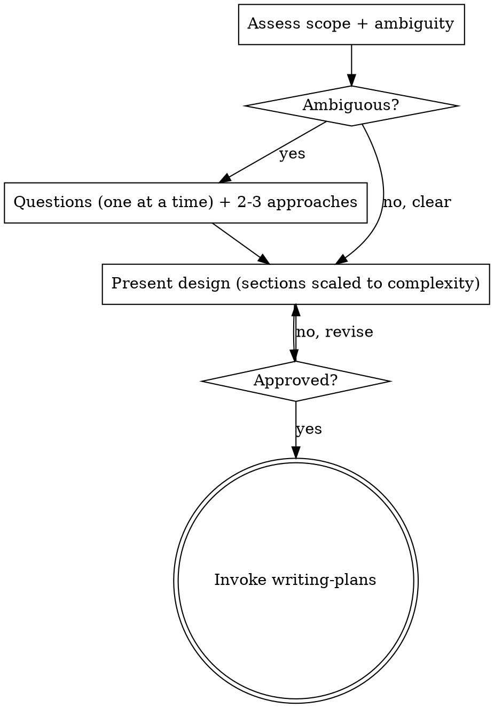

# Brainstorming

Turn an idea into an agreed design through short, focused dialogue, then hand off to writing-plans. You're here because the triage in using-cost-oriented-workflow judged the task non-trivial or ambiguous — a trivial, tightly-coupled change takes the light path (state intent, write inline, verify) and never reaches this skill. The gate below governs the design work that does; its **weight scales with the request** (C1).

<GATE>
For work that reaches this skill: do not write code, scaffold, or invoke an implementation skill until you have presented a design and the human has approved it. Scale the design to the request — a couple of sentences for a clear small feature, sectioned exploration for a messy one — but it must be stated and approved before code. (This is the "no code before an agreed approach" hard rule for non-trivial work.)
</GATE>

## Scale the gate to the request

- **Clear, small request** → restate the approach in 1-3 sentences, name the one or two risks, get a quick yes. Don't manufacture questions.
- **Ambiguous or messy request** → ask clarifying questions one at a time (multiple-choice when possible), propose 2-3 approaches with a recommendation, then present the design in sections.
- **Multiple independent subsystems** → stop and decompose first: name the independent pieces, how they relate, what order. Brainstorm the first sub-project through the normal flow; each gets its own design → plan cycle. Don't refine details of something that needs splitting.

## Flow

## Principles

- **One question at a time**; multiple choice preferred over open-ended.
- **YAGNI ruthlessly** — strip unnecessary features from every design.
- **Explore the existing code first** in an existing codebase; follow its patterns; propose targeted improvements only where they serve this goal (no unrelated refactoring).
- **Design for isolation:** each unit has one purpose, a well-defined interface, and can be understood and tested on its own. If you can't say what a unit does without reading its internals, the boundaries need work.

## After approval

- **standard mode:** the agreed design can stay inline in the conversation — no separate spec document required. Go straight to writing-plans.
- **production mode (or on request):** write the design to `docs/specs/YYYY-MM-DD-<topic>.md`, scan it for placeholders/contradictions/ambiguity, fix inline, and ask the human to review it before planning.

The only skill you invoke next is **`cost-oriented-agentic-workflow:writing-plans`**.
