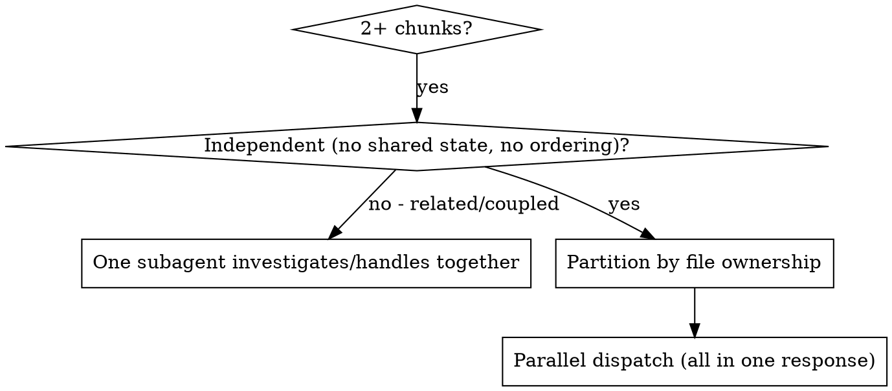

# Dispatching Parallel Agents

Independent chunks — separate subsystems, unrelated test failures, disjoint files — can be worked concurrently. Dispatch one subagent per chunk; let them run at once. This preserves your context for coordination and finishes N problems in the time of one.

**Core principle:** one subagent per independent chunk, each with its own isolated context that you construct.

## When to use

Use when chunks have different root causes / live in different subsystems and each can be understood without the others. Don't use when fixing one might fix another, when you need full-system context, or when you're still exploring what's broken.

## Strict file ownership (the conflict guard — D7)

Before dispatching, **partition the files** so each subagent owns a disjoint set. Two subagents must never write the same file. State each subagent's owned paths in its prompt ("you may edit only X and Y"). This non-overlapping ownership — not a worktree — is what prevents collisions in the common case.

**Worktrees (D9):** not needed in standard single-stream work, and not needed for parallel work you can partition by file. **If two chunks would touch the same file, they are not parallelizable — sequence them; a worktree isolates checkouts but does not make concurrent edits to one file merge cleanly.** Reach for a git worktree only for production isolation, or to give disjoint parallel subagents their own checkouts. See using-git-worktrees.

## Dispatch

Issue all dispatches in **one response** — that is what makes them run in parallel (one per response is sequential). Each prompt is focused (one chunk), self-contained (all context it needs, constructed by you — never your session history), specific about owned files, and explicit about what to return. Always specify the model.

## Integrate

When they return: read each summary, check that changes don't conflict (they shouldn't, given disjoint ownership), run the full verification once over the combined result, and spot-check — parallel subagents can make the same systematic error independently.
