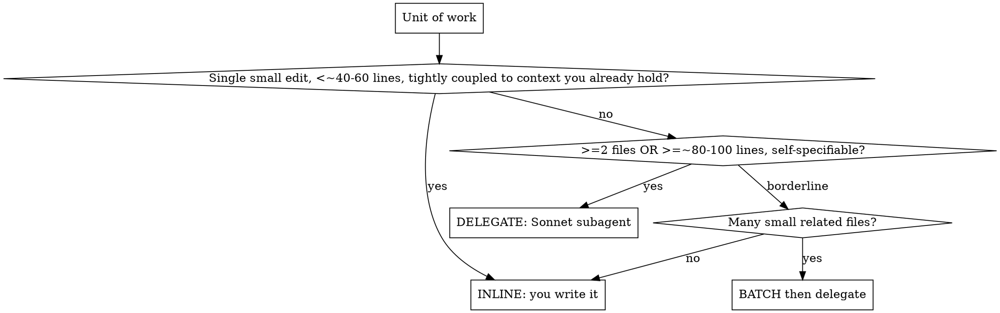
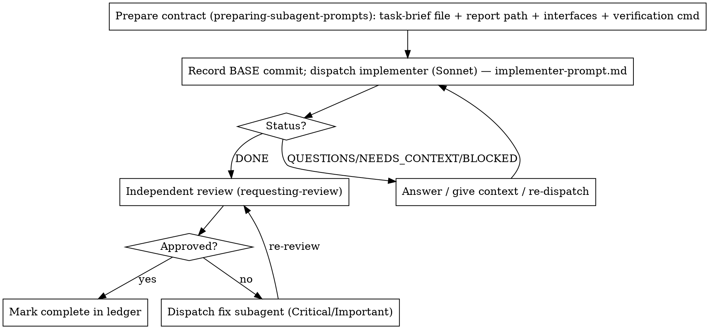

# Execution Routing

Turn a plan into working code while spending the controller's expensive tokens only where they change the outcome. For each unit of work you make one decision first — **write it yourself (inline) or delegate it to a Sonnet subagent** — then run the loop for whichever you chose.

**Core economy:** You (Opus) route and review. A Sonnet subagent (high effort) does the token-heavy reasoning and writing. Bulk artifacts move as files; the controller reads summaries and verification, never pasted code bodies.

## Pre-flight: scan the plan once (a real step, not a vibe)

Before routing the first unit, run this checklist over the plan and **emit its result** — do not skip it as "looks fine":

1. **Constraint vs task** — does any task contradict the Global Constraints?
2. **Acceptance vs interface/logic** — does any task's Acceptance contradict its own Interfaces or stated logic? (e.g. a field the constraints say to *keep* but an acceptance calls "ignored"; a heuristic that triggers on `A or B present` but whose acceptance says `only B`.) A real dogfooded plan shipped with exactly these — they hide in mid-flight edits that touch one section but not the others.
3. **Plan-mandated defects** — anything the plan mandates that a reviewer would flag (a test that asserts nothing, a duplicated logic block)?

Emit one of exactly two outputs: a single **batched** question to the human (each finding beside the plan text that mandates it, asking which governs) — or the line `Pre-flight scan: clean.` Never proceed without one of them. (A single trivial unit skips this; it earns its keep on a real multi-task plan.) The per-unit review loop still catches conflicts that only surface during implementation.

## The routing gate: contract cost (decide per unit)

Delegating is not free — you pay to write the contract, dispatch, and review the return. Delegation only wins when the code you'd save outweighs that overhead.

**Compare:** the cost of writing a self-contained contract (scope + interfaces + acceptance criteria + verification command) against the cost of just writing the code yourself.

The thresholds are guides, not law — the real test is "does the contract cost less than the code." When the contract would be nearly as much work as the code (the change is tightly coupled to context only you hold), write it inline.

## Risk gate (overrides the size gate)

Contract-cost decides *cost*; it does not decide *safety*. A unit in the hard-exclusion list (using-cost-oriented-workflow → Risk classification — auth, secrets, migrations, money, privacy, shared state, public API, dependencies, prod/CI config, irreversible side effects) is **never** light-path and **never** "inline with only your own seam check," however few lines it is. You may still write it inline, but it then takes an **independent review** per the risk matrix. Carry the task's recorded **Risk** level into every dispatch so the reviewer applies the right lens.

## Model selection (pin it explicitly)

**Always specify the model on every dispatch.** An omitted model inherits your expensive controller model and silently defeats the economy.

- **Writer (implementer):** Sonnet, high effort. A focused contract is enough for it to reason and write well.
- **Reviewer:** Sonnet, a *different instance* from the writer (independence). Scale effort to diff risk.
- **Controller:** you (Opus) — routing, contracts, seam-level review.
- **production only:** for a very large or genuinely complex generation, dispatch an Opus subagent as the writer; reviewer still independent.

## Pin the seams, free the interior

The contract pins only **between-unit** facts: file names, function/type signatures, data shapes, how it integrates with existing code, acceptance criteria, and the exact verification command. It leaves the **within-unit** implementation to the subagent — "the interior is yours."

Drift then lands in the cheap, easy-to-catch interior, while the expensive between-unit seams stay locked. Mode sets thickness: **standard** pins the interface only (accept interior variance); **production** also pins key behaviors and required tests.

## The delegate loop

**Inline path:** when you chose inline, write it, run its verification, and record the unit in the ledger (commit per the Commit policy below). No dispatch and no review subagent for a few low-risk lines — your own seam check suffices. But reach for the review subagent when the inline change is non-trivial, and a **hard-exclusion-risk** change always gets an independent review even when you wrote it inline (risk gate).

## Return protocol (keep the controller lean)

The implementer writes its full report to a **report file** and returns only: **Status**, files changed, a one-line test summary, concerns, and the report path — it does **not** commit (see Commit policy). The reviewer reads the diff from a **package file** (`scripts/review-package BASE HEAD`, which also includes uncommitted working-tree changes) and returns a verdict + findings. Code bodies and full diffs stay in files — they never re-enter your context.

Hand work over as files, not pasted text:
- **Brief:** `scripts/task-brief PLAN_FILE N` extracts the task into `task-N-brief.md`; the dispatch points to it as the source of requirements.
- **Report:** name it `task-N-report.md`; the implementer writes there.
- **Diff:** `scripts/review-package BASE HEAD` writes the package file; pass its path to the reviewer. Use the BASE you recorded before dispatching — never `HEAD~1`.

## Commit policy

Default: **controller-per-unit.** The delegated implementer and the inline writer leave changes in the working tree; **you (the controller) commit each unit after it passes review**, so git history holds reviewed commits, not pre-review snapshots. Record BASE = HEAD before the unit; the working tree carries the diff and `review-package` includes it, so the unit is fully reviewable before it is committed. Each committed unit is a ledger/recovery boundary.

Override only by repo or user preference, and note it in the anchor when non-default:
- `implementer` — the delegated worker commits its own unit (then the dispatch and return protocol ask for commit SHAs instead of "files changed").
- `user-owned` — leave units uncommitted for the human to commit.
- `none` — throwaway/experimental; no commits.

A trivial light-path edit does not force a commit under any policy.

## Handling implementer status

- **DONE** — generate the review package and go to review.
- **DONE_WITH_CONCERNS** — read the concerns first; if they touch correctness or scope, resolve before review.
- **NEEDS_CONTEXT** — provide what was missing, re-dispatch.
- **BLOCKED** — assess: more context? more capable model? task too large to split? a bug to root-cause (systematic-debugging)? plan wrong (escalate to human)?

**Retry budget (D8):** a subagent gets at most **2 extra attempts**, and only with something changed (more context, a more capable model, or a smaller scope). If it still fails, stop and bring it back to yourself — never loop the same model on the same prompt.

**When the failure is a bug or a failing test** (not missing context or a too-large task), find the root cause first — **systematic-debugging** — and dispatch the fix *with* that cause stated, not "make the test pass." A retry spent on a guess is the exact loop this workflow exists to avoid; root-cause-first is cheaper than thrashing.

## Batching and parallelism

- **Batch** a coherent cluster — interdependent files or one subsystem — into a single delegated package so the contract overhead is amortized once.
- **Parallel:** independent chunks can run as separate subagents at the same time — see **dispatching-parallel-agents**. Enforce **strict non-overlapping file ownership** (each subagent owns a disjoint file set). **Chunks that would touch the same file are not parallelizable — sequence them.** A worktree isolates checkouts; it does not make two concurrent edits to one file merge cleanly. Use a worktree only for production isolation, never as permission to parallelize overlapping work.

## Durable progress (anti-drift)

Conversation memory does not survive compaction. Track completed units in a **ledger file** (e.g. `<git-dir>/cow/progress.md`), one line per finished unit: `Unit N: complete (commits <base7>..<head7>, review clean)`. On resume or after compaction, units marked complete there are DONE — do not re-dispatch them. Trust the ledger and `git log` over recollection.

## When all units are done

The per-unit loop gates each task in isolation; it does not catch problems that only appear where units meet. After the last unit, before claiming the branch is finished:

1. **One whole-work review** — dispatch the broad reviewer (requesting-review, whole-work scope) over the full branch diff: `scripts/review-package MERGE_BASE HEAD`, where `MERGE_BASE = git merge-base main HEAD`. It reads integration and architecture, not one task. Resolve Critical/Important as in the per-unit loop. (A single trivial unit doesn't need this second pass — its own review sufficed.)
2. **Integrate** — hand off to **finishing-a-development-branch**: verify tests, then merge / PR / keep / discard, then clean up.

## Red flags

- Dispatching a subagent without specifying its model (inherits Opus — expensive).
- Pasting a task's full text, a diff, or a subagent's code back into your own context.
- Delegating a three-line change (contract costs more than the code) — write it inline.
- Letting the writer's self-review replace an independent review on a risky change.
- Re-dispatching a unit the ledger already marks complete.
- Moving on with open Critical/Important findings.

## Templates

- [implementer-prompt.md](implementer-prompt.md) — dispatch the writer
- [task-reviewer-prompt.md](task-reviewer-prompt.md) — dispatch the independent reviewer

**Related:** preparing-subagent-prompts (contract packaging) · requesting-review (review depth by mode) · receiving-code-review (adjudicate findings before fixing) · verification-before-completion (evidence) · systematic-debugging (root-cause a failed/blocked unit before re-dispatching) · dispatching-parallel-agents (parallel + file ownership) · finishing-a-development-branch (integrate when all units are done).
