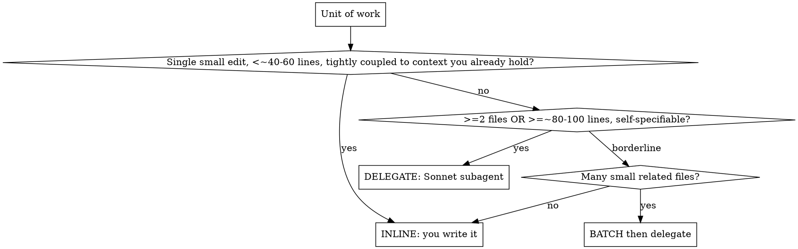
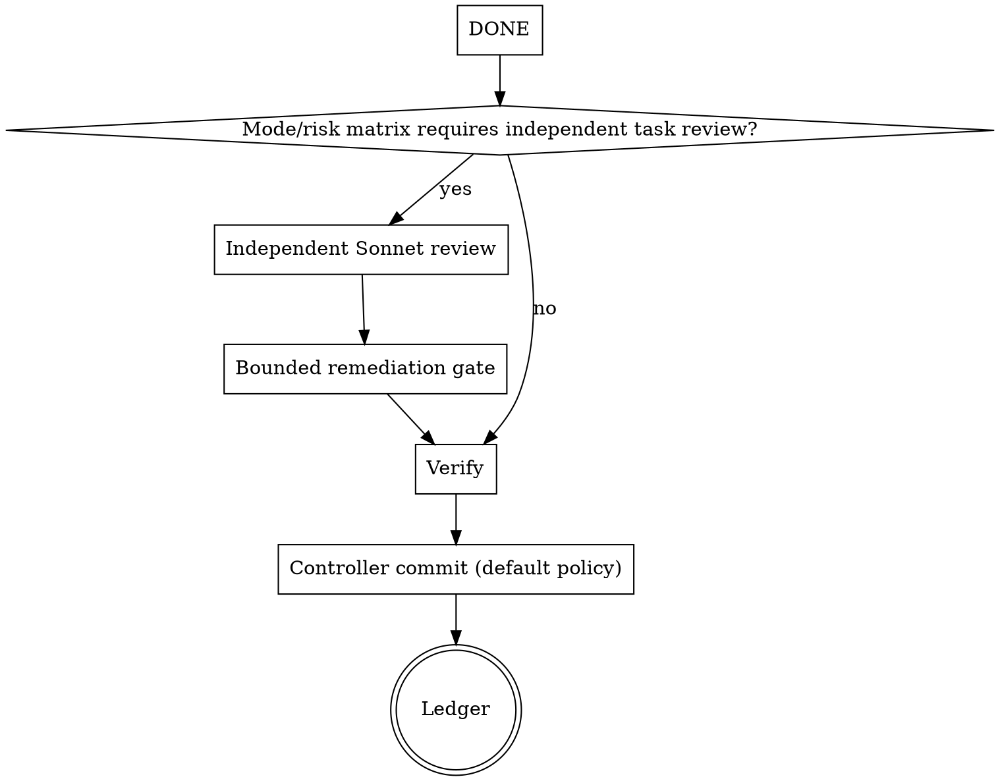

# Execution Routing

Turn a plan into working code while spending the controller's expensive tokens only where they change the outcome. For each unit of work you make one decision first — **write it yourself (inline) or delegate it to a Sonnet subagent** — then run the loop for whichever you chose.

**Core economy:** You (Opus) route and review. A Sonnet subagent (high effort) does the token-heavy reasoning and writing. Bulk artifacts move as files; the controller reads summaries and verification, never pasted code bodies.

## Plan pre-flight

Before Task 1, scan once for Global-Constraint/task conflicts, Acceptance/interface contradictions, and plan-mandated defects. Emit `Pre-flight scan: clean.` or one batched question quoting each conflicting plan line and asking which governs. Do not proceed on ambiguity. A single trivial unit skips this scan.

## Repository-state pre-flight

Before Task 1, require `git status --porcelain` empty for planned/delegated work. If dirty, stop and offer commit, stash, or isolated-worktree choices; never absorb unknown changes. Default `controller-per-unit` must be clean again after each reviewed commit.

Resume exception for `user-owned`/`none`: allow dirty paths only when every path is inside completed ledger `files=` scopes. Any outside path hard-stops for human classification.

## Pin run identity once

Before reading or writing any run artifact, execute `scripts/cow-workspace` and use only the directory it prints. Never create `.cost-oriented-agentic-workflow/run/` or `progress.md` manually. After every artifact write and at the final gate, `git status --short -- .cost-oriented-agentic-workflow/` **must be empty**; a non-empty result means the workspace was not initialized correctly — hard-stop and run the helper before continuing.

Before Task 1, create or read the workspace `progress.md` header:

```text
PLAN_FILE:
MODE:
COMMIT_POLICY:
BASE_BRANCH:
MERGE_BASE_SHA:
```

For a new run, set the plan path, mode, and active commit policy (default `controller-per-unit`). Resolve the base from an explicit decision or one credible repo-default/`main`/`master`/`develop` candidate; never mistake the feature branch's upstream for its base. If ambiguous, ask before Task 1. Record `MERGE_BASE_SHA = git merge-base HEAD "$BASE_BRANCH"` once. Never recompute either value mid-run; resume reads the ledger.

## The routing gate: contract cost (decide per unit)

Delegating is not free — you pay to write the contract, dispatch, and review the return. Delegation only wins when the code you'd save outweighs that overhead.

**Compare:** the cost of writing a self-contained contract (scope + interfaces + acceptance criteria + verification command) against the cost of just writing the code yourself.



The thresholds are guides, not law — the real test is "does the contract cost less than the code." When the contract would be nearly as much work as the code (the change is tightly coupled to context only you hold), write it inline.

## Risk gate (overrides the size gate)

Contract cost never overrides safety. Classify with using-cost-oriented-workflow's hard exclusions; those units never take the light path. They may be inline, but review follows the mode/risk matrix. Carry mode + risk into every dispatch.

## Model selection (pin it explicitly)

**Always specify the model on every dispatch.** An omitted model inherits your expensive controller model and silently defeats the economy.

- **Writer (implementer):** Sonnet, high effort. A focused contract is enough for it to reason and write well.
- **Reviewer:** Sonnet, a *different instance* from the writer (independence). Scale effort to diff risk.
- **Controller:** you (Opus) — routing, contracts, seam-level review.
- **production only:** for a very large or genuinely complex generation, dispatch an Opus subagent as the writer; reviewer still independent.

## Pin the seams, free the interior

The contract pins only **between-unit** facts: file names, function/type signatures, data shapes, how it integrates with existing code, acceptance criteria, and the exact verification command. It leaves the **within-unit** implementation to the subagent — "the interior is yours."

Drift then lands in the cheap, easy-to-catch interior, while the expensive between-unit seams stay locked. Mode sets thickness: **standard** pins the interface only (accept interior variance); **production** also pins key behaviors and required tests.

## Execute and review each unit

Prepare and dispatch delegated work as below. When an inline or delegated unit reaches `DONE`, branch on the central mode/risk matrix:



This branch applies equally to inline and delegated work: standard/low uses self-review + final whole-work review; production sends every planned task to an independent Sonnet; high risk is always independently reviewed.

## Return protocol (keep the controller lean)

The implementer writes its full report to a **report file** and returns only: **Status**, files changed, a one-line test summary, concerns, and the report path — it does **not** commit (see Commit policy). The reviewer reads the diff from a **package file** and returns a verdict + findings. Code bodies and full diffs stay in files — they never re-enter your context.

Hand work over as files, not pasted text:
- **Workspace:** `scripts/cow-workspace` resolves the self-ignored, per-worktree artifact directory at `<repo-root>/.cost-oriented-agentic-workflow/run/`.
- **Brief:** `scripts/task-brief PLAN_FILE N` extracts the task into `task-N-brief.md` there; the dispatch points to it as the source of requirements.
- **Report:** place `task-N-report.md` beside the brief; the implementer writes there.
- **Task diff:** pass the task's exact plan `Files` paths: `scripts/review-package BASE HEAD -- PATH...`. This includes committed, staged, unstaged, and untracked content only for that scope. Use the BASE recorded before dispatching — never `HEAD~1`.
- **Whole-work diff:** omit paths: `scripts/review-package MERGE_BASE HEAD`. Branch mode includes committed work only and exits `4` with dirty filenames when current HEAD is dirty.

## Commit policy

Default: **controller-per-unit.** The delegated implementer and the inline writer leave changes in the working tree; **you (the controller) commit each unit after it passes review**, so git history holds reviewed commits, not pre-review snapshots. Record BASE = HEAD before the unit; review the working tree with task-scoped `review-package ... -- PATH...`, then commit. Confirm the tree is clean before starting the next unit. Each committed unit is a ledger/recovery boundary.

Override only by repo or user preference, and note it in the anchor when non-default:
- `implementer` — the delegated worker commits its own unit (then the dispatch and return protocol ask for commit SHAs instead of "files changed").
- `user-owned` — leave units uncommitted for the human to commit.
- `none` — throwaway/experimental; no commits.

A trivial light-path edit does not force a commit under any policy.

## Handling implementer status

- **DONE** — generate the review package and go to review.
- **DONE_WITH_CONCERNS** — read the concerns first; if they touch correctness or scope, resolve before review.
- **NEEDS_CONTEXT** — provide what was missing, re-dispatch.
- **BLOCKED** — assess: more context? more capable model? task too large to split? a bug to root-cause (systematic-debugging)? plan wrong (escalate to human)?

**Retry budget (D8):** a subagent gets at most **2 extra attempts**, and only with something changed (more context, a more capable model, or a smaller scope). If it still fails, stop and bring it back to yourself — never loop the same model on the same prompt.

**When the failure is a bug or a failing test** (not missing context or a too-large task), find the root cause first — **systematic-debugging** — and dispatch the fix *with* that cause stated, not "make the test pass." A retry spent on a guess is the exact loop this workflow exists to avoid; root-cause-first is cheaper than thrashing.

## Bounded remediation gate

- Allow at most **2 remediation waves** per task or final whole-work review. One wave = one fixer addressing all accepted *introduced/worsened* Critical/Important findings, covering tests, then a fresh targeted independent reviewer.
- False-positive adjudication uses no wave. A pre-existing Critical/Important uses no original-unit wave: get risk acceptance, or make the human-approved scope a new unit. A plan conflict also uses no wave; ask the human which governs.
- If the same finding survives wave 1, do not apply a second blind fix: use systematic-debugging/root cause or controller adjudication first.
- After wave 2, any open Critical/Important stops autonomous execution and is surfaced with evidence. **Budget exhausted ≠ approved.** The implementer's 2-extra-attempt budget above is separate.

## Batching and parallelism

- **Batch** a coherent cluster — interdependent files or one subsystem — into a single delegated package so the contract overhead is amortized once.
- **Parallel:** independent chunks can run as separate subagents at the same time — see **dispatching-parallel-agents**. Enforce **strict non-overlapping file ownership** (each subagent owns a disjoint file set). **Chunks that would touch the same file are not parallelizable — sequence them.** A worktree isolates checkouts; it does not make two concurrent edits to one file merge cleanly. Use a worktree only for production isolation, never as permission to parallelize overlapping work.

## Durable progress (anti-drift)

Write every completed unit to `<repo-root>/.cost-oriented-agentic-workflow/run/progress.md`:

```text
Unit N | route=<inline|delegate> | risk=<low|elevated|high> | files=<paths>
review=<none|required:clean> | waves=<0..2> | verify=<result>
commit=<base..head>
```

Never mark a unit complete with open Critical/Important findings. Record final-review state too; before surfacing exhaustion, persist `waves=2` + open findings as blocked so resume cannot reset the budget. `scripts/cow-workspace` copies a missing ledger from legacy `<git-dir>/cow/progress.md` without deleting it. On resume trust ledger + `git log`; `git clean -fdx` may delete the ignored ledger, so git remains the fallback.

## When all units are done

The per-unit loop gates each task in isolation; it does not catch problems that only appear where units meet. After the last unit, before claiming the branch is finished:

1. **One whole-work review** — read `MERGE_BASE_SHA` from the ledger and review `scripts/review-package MERGE_BASE_SHA HEAD`: standard → Sonnet, production → Opus. Apply the same bounded remediation gate. Standard may skip this only for a single planned unit that already had independent review; production never skips it.
2. **Integrate** — hand off to **finishing-a-development-branch**: verify tests, then merge / PR / keep / discard, then clean up.

## Red flags

- Dispatching a subagent without specifying its model (inherits Opus — expensive).
- Pasting a task's full text, a diff, or a subagent's code back into your own context.
- Delegating a three-line change (contract costs more than the code) — write it inline.
- Letting the writer's self-review replace an independent review on a risky change.
- Re-dispatching a unit the ledger already marks complete.
- Moving on with open Critical/Important findings.

## Templates

- [implementer-prompt.md](implementer-prompt.md) — dispatch the writer
- [task-reviewer-prompt.md](task-reviewer-prompt.md) — dispatch the independent reviewer

**Related:** preparing-subagent-prompts (contract packaging) · requesting-review (review depth by mode) · receiving-code-review (adjudicate findings before fixing) · verification-before-completion (evidence) · systematic-debugging (root-cause a failed/blocked unit before re-dispatching) · dispatching-parallel-agents (parallel + file ownership) · finishing-a-development-branch (integrate when all units are done).
