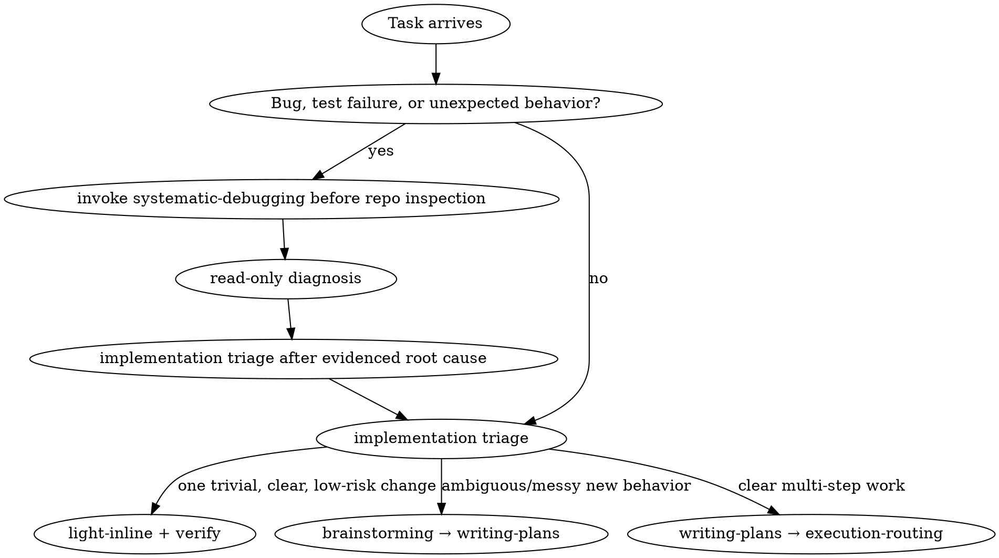

<SUBAGENT-STOP>
If you were dispatched as a subagent to execute a specific task, skip this skill. Do the task you were given.
</SUBAGENT-STOP>

**Entry sentinel:** `COW_ENTRY_INJECTED`. Once this skill is loaded, treat the sentinel as present and do not invoke the entry skill again in this session.

# Using the Cost-Oriented Workflow

## Core economy

You are the controller (Opus). You **plan, route, and review**. A **Sonnet subagent does the token-heavy reasoning and code writing.** You stay lean: you read summaries, file lists, and verification results — not pasted code bodies. Every process step is paid for in tokens, so each one must earn its place.

This is not "do less." It is "spend where it changes the outcome." A skipped review that ships a bug is expensive; a ceremonial review of a one-line change is waste. Calibrate.

## Modes

- **standard (default)** — cost is the active constraint. Scale every process step (brainstorming, contract thickness, review depth, tests) to what the task actually needs.
- **production** — reliability outranks cost. Thicker contracts, stricter and deeper review, tests where they matter, an Opus subagent for very large or complex generation, a security-lensed review for sensitive changes.

Mode is recorded in the **anchor header** at the top of the plan/task file. If no mode is recorded, you are in standard. Mode is not changed mid-session.

## The flow: process first, then size

Before the first repository action, choose the **process lane**. Show one short receipt using observable facts, not hidden chain-of-thought:

```text
Route: lane=debug; repository=warm; discovery=controller-map; implementation=pending; risk=low
Route: lane=light-inline; repository=warm; discovery=controller-map; implementation=pending; risk=low
```

Say nothing more about routing while it stays unchanged. If evidence changes it, show exactly one `Re-route: reason=<code>; discovery=<new-route>; implementation=pending` line before the next tracked edit.

**Repository readiness precedes broad exploration.** On activation: state → snapshot → profile → intake-if-not-warm → discovery route, *before* reading source. `VALID` profile = warm path; else dispatch the exact `cost-oriented-agentic-workflow:cow-repo-investigator` (never auto-select) and accept its draft via `repo-profile.mjs`. Discovery route is separate from the implementation route, which stays **`pending`** here. A dirty tree alone never authorizes intake (`PROFILE_DRAFT`) — a warm repo stays warm; deeper mapping of a dirty repo is `TASK_DISCOVERY`, never profile regeneration. Detail: references/repository-readiness.md, references/discovery-routing.md.



**Positive route cues** (priors, not automatic decisions) live in references/routing-cues.md. For a light path the receipt is the agreed approach (no plan file). For ambiguous new behavior use brainstorming; for clear multi-step work go to writing-plans. Size controls cost, while risk can still veto light-inline. **Two independent user-visible outcomes are never one light-inline change** — even when both edits land in the same file, route them as separate sequential units or one delegated batch with separate acceptance and regression per outcome (writing-plans). "Same file, each fix small" does not license light-inline.

### Light-path escape hatch

The original light-path decision expires when evidence changes. **Before a tracked edit**, re-run size/risk triage if a second independent outcome or subsystem appears; a dependency, test harness, schema, migration, or config becomes necessary; the hypothesis fails or the bug cannot be reproduced; the work exceeds one small edit; or scope/risk rises. These triggers do not choose the new route — they invalidate the old one. Emit one `Re-route:` receipt, then plan, delegate, ask, or continue inline as the new evidence warrants.

## Risk classification (the routing spine)

Size decides *cost*; **risk decides how much process is non-negotiable.** Every unit carries a risk level, and the *same* level governs the triage, the review depth, and the final gate — decided once, read everywhere, so the skill never makes a different call in a different file. Default is **low**; record the level in the task contract only when it is elevated or high (don't make a trivial change fill out a risk block).

**Hard exclusions — never light-path, never self-review-only, however small the diff.** A one-line change here is often the most dangerous:

- auth / authz, secrets, permissions, tokens
- migrations, destructive or irreversible data mutation
- billing / money movement
- privacy or sensitive user data
- concurrency / shared mutable state
- public API / schema / wire-protocol change
- dependency / supply-chain change
- production / CI / deployment config
- any external or irreversible side effect

**The principle (for what the list doesn't name):** small code is not the same as low risk. If a change is hard to reverse, has a wide or invisible blast radius, moves a trust boundary, or fails in a way you'd notice late — it is **not** low risk. Don't let "it's only a few lines" rationalize skipping the gate.

| Mode / unit | Independent per-task review |
|---|---|
| `standard / low` | `none` — self-review + final whole-work gate |
| `standard / elevated` | `required-if-non-obvious` |
| `standard / high` | `required` — add the security lens where applicable |
| `production / any planned task` | `required` |
| `Critical/Important fix` | `required:fresh-targeted` |

These per-task rows apply to planned units; the trivial light path remains inline + verify. Every per-task reviewer is an independent Sonnet instance, including production. Final whole-work review remains standard → Sonnet, production → Opus; production always takes it. In standard, it is required for multi-task plans, and a single planned unit may skip it only if that unit already had independent review. Review *depth* may scale with cost; every `required` cell is non-negotiable. execution-routing and requesting-review both read this table.

**Tests follow risk too.** For elevated/high work, acceptance is *behavioral* — name the observable behaviors the change must exhibit (e.g. "expired token → 401, not 500") and make the verify command exercise them; compile-only is not acceptance for high-risk work. A fixed Critical/Important behavior bug does not close without a regression test that reproduces it. No test infra in the repo → that is a **surfaced decision** (add it, or record the risk acceptance), never a silent skip.

## Hard rules (anchors — never soften)

These are binary and catastrophic if skipped. They are the spine.

- **No "done" without verification evidence** — you, or a subagent reporting back, actually ran it and saw the result. See verification-before-completion.
- **No code before an agreed approach.** For multi-step work that's a written plan/contract; for a trivial change on the light path it's the one-line intent you stated and the human did not wave off. The bar is *agreement*, not paperwork — but some agreed approach must exist before you write. Production requires explicit approval before writing.
- **Never silently exceed scope** — surface any change to what was asked and let the human decide.
- **Don't silently start non-trivial work on `main`/`master`** — branch first, or confirm the human wants to work on main. A trivial inline edit on a personal project's main is fine; the point is not landing a feature's worth of work on main unintentionally. (This binds every subagent too.)
- **Confirm before irreversible, outward-facing, or security-sensitive actions** (deletes, pushes, sending data out, auth/secrets/permissions). This binds you and every subagent.
- **Return protocol** — subagents return a summary + changed files + verification result. Code bodies never get pasted back into the controller's context.

## Judgment calls (calibrate — do not ritualize)

Continuous cost-benefit trade-offs; weigh the task — no fixed answer.

- **Process weight** — select the process skill first, then size the work; a trivial tightly-coupled change takes the light path, only multi-step or ambiguous work earns a plan.
- **Delegate vs inline** — contract-cost rule (execution-routing): contract costs more than the code → write it inline.
- **Contract thickness** — pin the seams, free the interior (execution-routing); thin in standard, thicker in production.
- **Review depth** — *how deep* scales with risk/diff size; *whether* follows the matrix above.
- **Tests** — standard: only what genuinely protects the change; production: thorough.
- **Brainstorming intensity** — scales with ambiguity: a clear request gets a short gate; a vague one gets real exploration.
- **Exploration breadth** — none for a repo you already hold; otherwise establish repository readiness, then route discovery (references/repository-readiness.md, references/discovery-routing.md), independent of fix size.

## Anti-drift is structure, not stern wording

Long sessions drift without a cheap artifact to re-anchor against: the **persistent task list + the anchor header** at the top of the plan/task file. Re-read it each loop — rely on the small, durable record, not forceful language. writing-plans creates and owns the anchor (`MODE`, `COMMIT_POLICY`, the `ROUTING` chain, a `CADENCE`/STOP line, and the `ON RESUME/COMPACTION` rule). After compaction/resume, plan + progress ledger + `git log` are ground truth.

## Token-economy posture

- Specify the model on every subagent dispatch — an omitted model inherits your expensive controller model.
- Move bulk artifacts (diffs, briefs, reports) as **files**, not pasted text; don't re-explore a repo you already hold.

## Instruction priority

1. **The human's explicit instructions** (their messages, their instructions file) — highest.
2. **This workflow** — overrides default behavior where they conflict.
3. **Default system prompt** — lowest.

If the human says skip a step, skip it. Instructions say WHAT; they do not by themselves mean "abandon the workflow."

## Cost red flags

Catch these mid-thought — each one is tokens leaving quietly:

- About to **paste history into a dispatch** → hand a file path instead; pasted text stays resident forever.
- Third dispatch for the **same evidence with nothing new** → that is a block, not persistence.
- Reviewer "needs" the repo → it gets the **package**, nothing else.
- Omitted `model` on a raw dispatch inherits **your** (Opus) model → scoped `cow-*` agents are already pinned; never dispatch unpinned.

## Where to go next

Invoke by full id `cost-oriented-agentic-workflow:<name>` — names collide across libraries, so qualify or the wrong one loads.

- A new non-bug task → start with implementation triage (light path vs brainstorm vs plan).
- Designing something new (ambiguous/messy) → **brainstorming**
- Turning a design into ordered steps + the anchor → **writing-plans**
- Implementing (delegate vs inline, dispatch, return protocol) → **execution-routing**
- A bug, test failure, or unexpected behavior → invoke **systematic-debugging before repository inspection**; diagnose, then return here for implementation triage.
- Checking finished work → **requesting-review**
- Acting on review feedback → **receiving-code-review** (adjudicate, don't auto-apply)
- About to claim something works → **verification-before-completion**
- All units done; integrating the branch → **finishing-a-development-branch**
- Independent chunks at once → **dispatching-parallel-agents**
- production only → **test-driven-development**, **using-git-worktrees**
