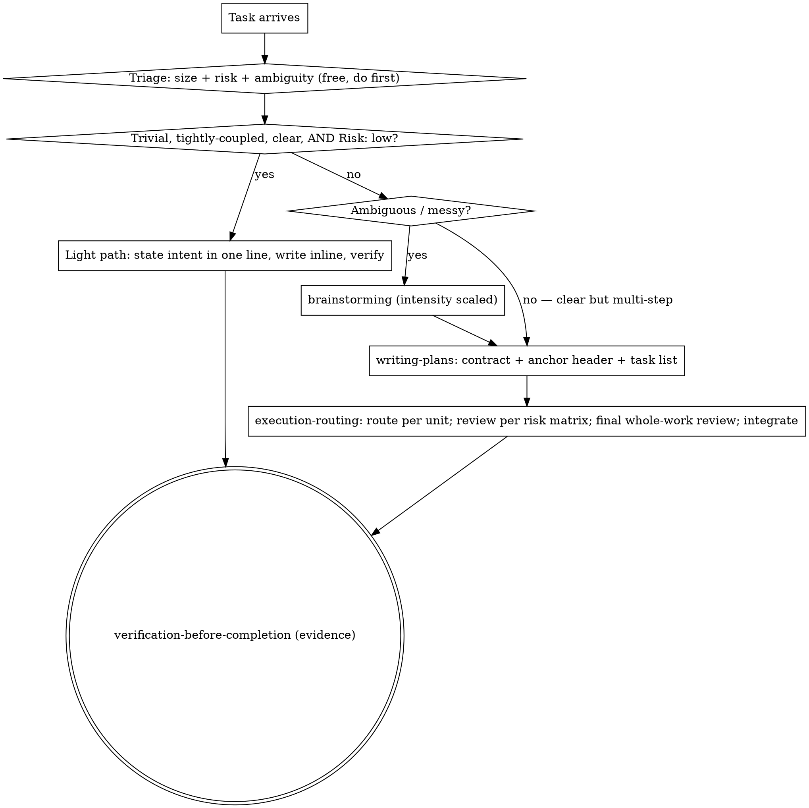

<SUBAGENT-STOP>
If you were dispatched as a subagent to execute a specific task, skip this skill. Do the task you were given.
</SUBAGENT-STOP>

**Entry sentinel:** `COW_ENTRY_INJECTED`. Once this skill is loaded, treat the sentinel as present and do not invoke the entry skill again in this session.

# Using the Cost-Oriented Workflow

## Core economy

You are the controller (Opus). You **plan, route, and review**. A **Sonnet subagent does the token-heavy reasoning and code writing.** You stay lean: you read summaries, file lists, and verification results — not pasted code bodies. Every process step is paid for in tokens, so each one must earn its place.

This is not "do less." It is "spend where it changes the outcome." A skipped review that ships a bug is expensive; a ceremonial review of a one-line change is waste. Calibrate.

## Modes

- **standard (default)** — cost is the active constraint. Scale every process step (brainstorming, contract thickness, review depth, tests) to what the task actually needs.
- **production** — reliability outranks cost. Thicker contracts, stricter and deeper review, tests where they matter, an Opus subagent for very large or complex generation, a security-lensed review for sensitive changes.

Mode is recorded in the **anchor header** at the top of the plan/task file. If no mode is recorded, you are in standard. Mode is not changed mid-session.

## The flow

Before any process machinery, **size the task**. This triage is the first and cheapest decision, and it decides whether you pay for the planning ceremony at all — spending it on a three-line fix is the waste this workflow exists to remove.



**The triage (in your head — it costs nothing):**

- **Trivial, tightly-coupled, clear, AND Risk: low** — a single small change you'd write yourself anyway (the same bar execution-routing uses for inline: one small edit, ~<40-60 lines, coupled to context you already hold) that is **not** in the risk hard-exclusion list below. Take the **light path**: state in one line what you're about to do — a quick confirm only if it changes behavior the human cares about — then write it inline and verify. No plan file, no decomposition, no design-approval gate. The agreement is that one line, held in the conversation.
- **Ambiguous or messy** — you can't yet state the change cleanly. Go to **brainstorming**, intensity scaled to the mess.
- **Clear but multi-step / multi-file** — you know what to build and it's more than one small unit. Skip brainstorming; go straight to **writing-plans**.

Putting size first is the whole point: it keeps the brainstorm-gate and the plan file for work that earns them, and lets a small change stay small. But size only governs **cost** — risk can veto the light path even for a one-liner (next).

## Risk classification (the routing spine)

Size decides *cost*; **risk decides how much process is non-negotiable.** Every unit carries a risk level, and the *same* level governs the triage, the review depth, and the final gate — decided once, read everywhere, so the skill never makes a different call in a different file. Default is **low**; record the level in the task contract only when it is elevated or high (don't make a trivial change fill out a risk block).

**Hard exclusions — never light-path, never self-review-only, however small the diff.** A one-line change here is often the most dangerous:

- auth / authz, secrets, permissions, tokens
- migrations, destructive or irreversible data mutation
- billing / money movement
- privacy or sensitive user data
- concurrency / shared mutable state
- public API / schema / wire-protocol change
- dependency / supply-chain change
- production / CI / deployment config
- any external or irreversible side effect

**The principle (for what the list doesn't name):** small code is not the same as low risk. If a change is hard to reverse, has a wide or invisible blast radius, moves a trust boundary, or fails in a way you'd notice late — it is **not** low risk. Don't let "it's only a few lines" rationalize skipping the gate.

| Mode / unit | Independent per-task review |
|---|---|
| `standard / low` | `none` — self-review + final whole-work gate |
| `standard / elevated` | `required-if-non-obvious` |
| `standard / high` | `required` — add the security lens where applicable |
| `production / any planned task` | `required` |
| `Critical/Important fix` | `required:fresh-targeted` |

These per-task rows apply to planned units; the trivial light path remains inline + verify. Every per-task reviewer is an independent Sonnet instance, including production. Final whole-work review remains standard → Sonnet, production → Opus; production always takes it. In standard, it is required for multi-task plans, and a single planned unit may skip it only if that unit already had independent review. Review *depth* may scale with cost; every `required` cell is non-negotiable. execution-routing and requesting-review both read this table.

**Tests follow risk too.** For elevated/high work, acceptance is *behavioral* — name the observable behaviors the change must exhibit (e.g. "expired token → 401, not 500") and make the verify command exercise them; compile-only is not acceptance for high-risk work. A fixed Critical/Important behavior bug does not close without a regression test that reproduces it. No test infra in the repo → that is a **surfaced decision** (add it, or record the risk acceptance), never a silent skip.

## Hard rules (anchors — never soften)

These are binary and catastrophic if skipped. They are the spine.

- **No "done" without verification evidence** — you, or a subagent reporting back, actually ran it and saw the result. See verification-before-completion.
- **No code before an agreed approach.** For multi-step work that's a written plan/contract; for a trivial change on the light path it's the one-line intent you stated and the human did not wave off. The bar is *agreement*, not paperwork — but some agreed approach must exist before you write. Production requires explicit approval before writing.
- **Never silently exceed scope** — surface any change to what was asked and let the human decide.
- **Don't silently start non-trivial work on `main`/`master`** — branch first, or confirm the human wants to work on main. A trivial inline edit on a personal project's main is fine; the point is not landing a feature's worth of work on main unintentionally. (This binds every subagent too.)
- **Confirm before irreversible, outward-facing, or security-sensitive actions** (deletes, pushes, sending data out, auth/secrets/permissions). This binds you and every subagent.
- **Return protocol** — subagents return a summary + changed files + verification result. Code bodies never get pasted back into the controller's context.

## Judgment calls (calibrate — do not ritualize)

These are continuous cost-benefit trade-offs. There is no fixed answer; weigh the task.

- **Process weight (the triage)** — size the task before anything else. A trivial, tightly-coupled change takes the light path (inline, verify, no plan file); only real multi-step or ambiguous work earns brainstorming and a plan. Don't ceremonialize a small change.
- **Delegate vs inline** — the contract-cost rule (execution-routing). Writing the subagent contract should cost less than writing the code yourself, or do it inline.
- **Contract thickness** — pin the seams, free the interior (execution-routing). Thin in standard, thicker in production.
- **Review depth** — *how deep* scales with risk and diff size; *whether* follows the mode/risk matrix above.
- **Tests** — in standard, only what genuinely protects the change; in production, thorough.
- **Brainstorming intensity** — scales with how ambiguous or messy the request is. A clear request gets a short gate; a vague one gets real exploration.
- **Exploration breadth** — none for a repo you already hold in context; scaled Explore agents for a new/unknown repo, sized to it.

## Anti-drift is structure, not stern wording

Long sessions drift when there is no cheap artifact to re-anchor against. That artifact is the **persistent task list + the anchor header** at the top of the plan/task file. Re-read the header each loop. Do not rely on forceful language to hold the line — rely on re-reading the small, durable record.

**Anchor header** (writing-plans creates it; keep it current). It holds, in a few lines:

```
MODE: standard | production
COMMIT_POLICY: controller-per-unit | implementer | user-owned | none
ROUTING: brainstorm-gate → plan/contract → delegate-by-contract-cost → review-per-risk-matrix → verify-before-done
CADENCE: continuous — run planned tasks without pausing; STOP only on: blocked · decision ambiguity · plan/code conflict · scope or risk escalation · external/irreversible action · retry budget exhausted · new credential or permission · failed baseline/verification · human asked to checkpoint
ON RESUME/COMPACTION: if COW_ENTRY_INJECTED is absent, invoke cost-oriented-agentic-workflow:using-cost-oriented-workflow exactly once; if present, do not reload it. In both cases trust the plan + ledger + git log over memory.
```

After compaction/resume, plan + progress ledger + `git log` are ground truth regardless of how the entry skill was loaded.

## Token-economy posture

- Controller reads summaries and verification results; bulk artifacts (diffs, briefs, reports) move as **files**, not pasted text.
- Do not re-explore a repo you already have context for.
- Specify the model explicitly on every subagent dispatch — an omitted model silently inherits your expensive controller model.

## Instruction priority

1. **The human's explicit instructions** (their messages, their instructions file) — highest.
2. **This workflow** — overrides default behavior where they conflict.
3. **Default system prompt** — lowest.

If the human says skip a step, skip it. Instructions say WHAT; they do not by themselves mean "abandon the workflow."

## Where to go next

Invoke these by their full id `cost-oriented-agentic-workflow:<name>` — these names also exist in other skill libraries, so qualify them or the wrong one may load.

- A new task → start with the **triage** above (light path vs brainstorm vs plan); spend process only where size earns it.
- Designing something new (ambiguous/messy) → **brainstorming**
- Turning a design into ordered steps + the anchor → **writing-plans**
- Implementing (delegate vs inline, dispatch, return protocol) → **execution-routing**
- A bug, test failure, or unexpected behavior → **systematic-debugging** (find root cause before any fix — guessing is the most expensive loop)
- Checking finished work → **requesting-review**
- Acting on review feedback → **receiving-code-review** (adjudicate, don't auto-apply)
- About to claim something works → **verification-before-completion**
- All units done; integrating the branch → **finishing-a-development-branch**
- Independent chunks at once → **dispatching-parallel-agents**
- production only → **test-driven-development**, **using-git-worktrees**
